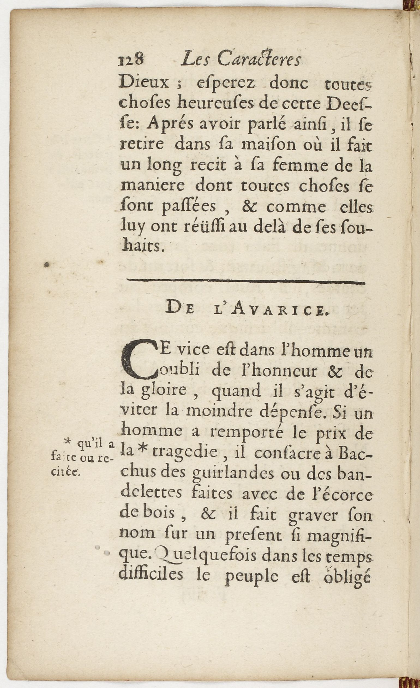
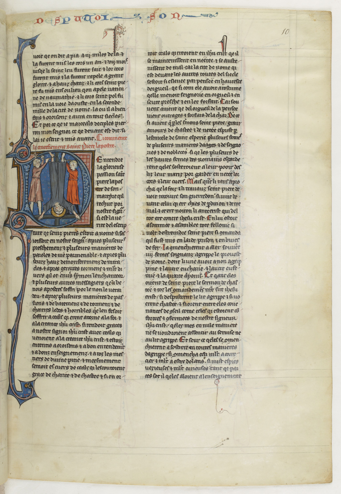
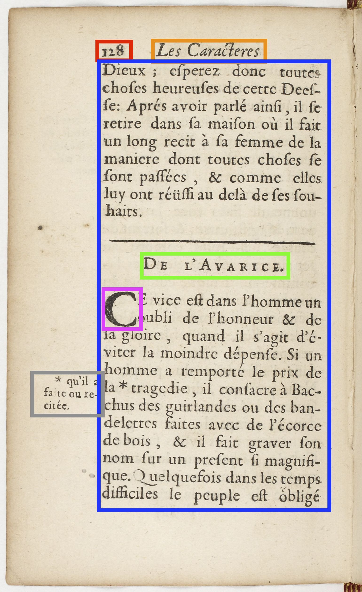
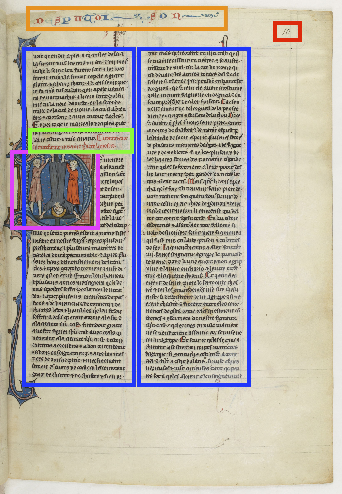

# The idea

The intuition behind SegmOnto is the following: most of the documents containing texts have a stable layout over time:  
 

 

At a low level, it is possible not only to find similarities, but to use the same name in order to describe homogeneously large quantities of data. In blue we see the body in red the page number, in orange the running title, in green intermediary titles, in pink drop capitals, in grey additional notes.

 
 

 

SegmOnto follows (with exceptions) two critera in its description of the page:

- It follows a generalist approach rather than a specific one. It aims at representing any document, and does not focus on any kind of source.
- It follows a descriptive approach, but remains open to a more semantic annotation via a system of subtypes.

It uses a two-tier description, following the two classification tasks required for any layout analysis:

- Zones, for the different types of regions on the page (running title, main text...)
- Lines for the different types of lines contained in the zones (interlinear lines, staves, rubrics...)

In order to cope with the complexity of documents, two safety devices are offered:

- The main types of zones and lines are not open to any modification, but a [`CustomZone`](https://segmonto.github.io/gd/gdZ/CustomZone/) and a [`CustomLine`](https://segmonto.github.io/gd/gdL/CustomLine), which functions as private zonee, offer the possibility to encode additional features that would have been forgotten.
- A [specific syntax](https://segmonto.github.io/gd/syntax), using a system of subtypes (using the following syntax: Type:Subtype) has been added and offers only suggested values: it is possible to opt for personal subtypes, functioning at the level of a specific document only.
