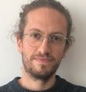
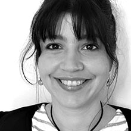
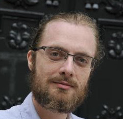
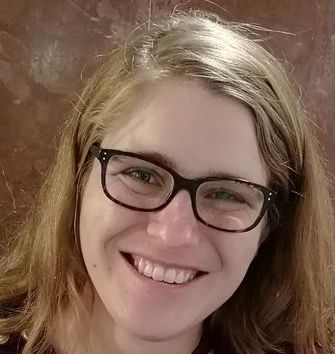
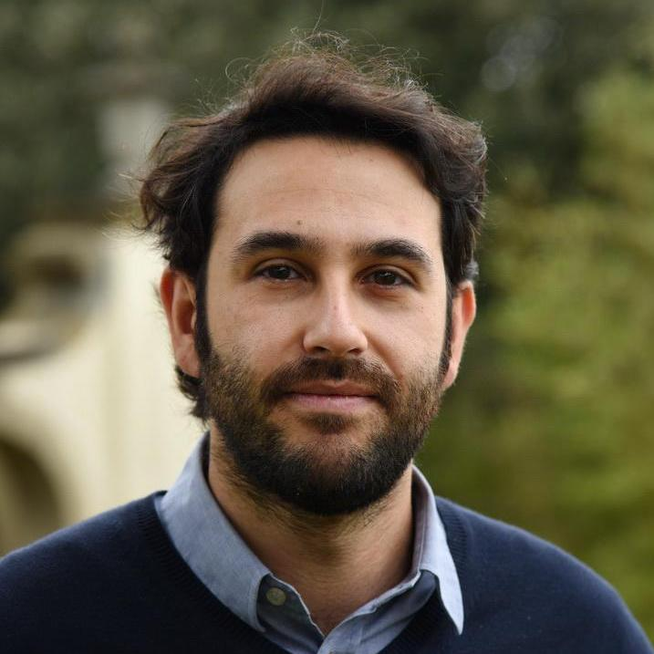

# Team

SegmOnto was designed by a group of international researchers. The final version of the guidelines has been carried by S. Gabay, J.-B. Camps and A. Pinche.

 Simon Gabay is Maître-assistant at the university of Geneva. He holds a PhD in latin philology, defended at the university of Amsterdam on the history of theatre in the early medieval documentation. His research now focuses on romance philology, and especially 17th c. French, a period for which he creates the necessary tools for computational exploration. His areas of interests are corpus building, diachronic linguistics, and the birth of the manuscript market in 19th c. France.

  Ariane Pinche has a PhD in medieval language and literature. She is currently a postdoctoral fellow at the École nationale des chartes | PSL and is particularly interested in digital editing. She won the Fortier Prize for the best young researcher paper at the Digital Humanities 2019 conference in Utrecht with her two colleagues J. B. Camps and T. Clérice for the paper "Stylometry for Noisy Medieval Data: Evaluating Paul Meyer's Hagiographic Hypothesis". Today, her research interests focus on the construction of medieval corpora for HTR (Handwritten Text Recognition) training.

 Jean-Baptiste Camps, a medievalist by training, is Maître de conférences at the Ecole nationale des chartes | PSL in Paris. He received a PhD for an edition of the Chanson d'Otinel in 2016 at the university Paris IV-Sorbonne. As a specialist of computational philology, his research include the transmission of manuscripts over centuries, stylometry and digital editing.

 Kelly Christensen obtained a doctorate in musicology from Stanford University in the United States and a master's degree in digital technologies applied to history from the École nationale des chartes in Paris. She joined the medialab team in September 2022 as a research engineer to work on two projects questioning the spread of online misinformation.

 
Nicola Carboni is a Postdoctoral Fellow at the University of Geneva. Previously Research Fellow for the Swiss Art Research Infrastructure at the University of Zurich. He completed his PhD in Engineering, on the topic of Knowledge Representation and Visual Heritage, at the CNRS & NTUA where he was also previously appointed Marie Curie Fellow. His research focuses on the conceptualisation and semantic description of tangible/intangible aspects of the heritage, specifically on the multi-interpretation of the spectrum of visual representations, iconography, ontological conceptualisation and linked data.

Additional contributors are:

- Daniel Stoekl
- Claire Jahan
- Juliette Janès
- Peter Stokes

We thank them for their constant help, their useful feedback and above all their time.
