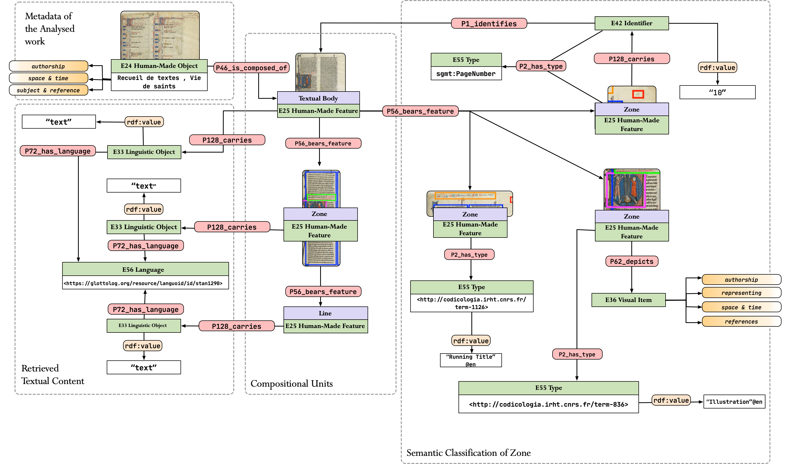

# RDF

In order to ensure a data-driven framework with interoperable resulting data, segmOnto relies on RDF. The latter is a Knowledge Representation framework for describing and interconnecting web-based resources. Using RDF it is possible to model the relationship between the diverse parts of the text and the other elements on the page, as well as interconnect the result of the pipeline with existing metadata described by cultural institutions.

## segmOnto Modelling

Necessary for creating such interconnection as well as to query the data is a formal definition of the model using an existing ontology or the creation of a novel one. The model developed for segmOnto relies on a combination of both, as it reuses [CIDOC-CRM](https://cidoc-crm.org), a well-known ontology for in the Digital Humanities / Digital Cultural Heritage domain, extending it to describe three novel classes which describe the basic block of text in a written medium.

The novel classes are documented [here](https://github.com/SegmOnto/ontology) while the model used to describe the result of the segmOnto pipeline is available in the image below.




## First result

The very first results that we obtain by the pipeline are below. The RDF has been generated by using [X3ML](https://github.com/isl/x3ml), an RDF generator that uses a script that takes XML in input and generates RDFs. 


```turtle
@prefix crm: <http://www.cidoc-crm.org/cidoc-crm/> .
@prefix rdfs: <http://www.w3.org/2000/01/rdf-schema#> .
@prefix sgmo: <http://lod.unige.ch/segmOnto/> .

<http://lod.unige.ch/segmOnto/page/eSc_dummypage_/eSc_textblock_9a1ebf95>
  a <http://www.cidoc-crm.org/cidoc-crm/E25_Human-Made_Feature>, sgmo:Zone ;
  crm:P190_has_symbolic_contents "2" ;
  crm:P67_refers_to <https://visualcontagions.unige.ch/resources/page/eSc_dummypage_/2> ;
  crm:P2_has_type <http://lod.unige.ch/segmOnto/vocab/PageNumber> .

<https://visualcontagions.unige.ch/resources/page/eSc_dummypage_/2>
  a crm:E42_Identifier ;
  crm:P1i_identifies <https://visualcontagions.unige.ch/resources/page/eSc_dummypage_> .

<https://visualcontagions.unige.ch/resources/page/eSc_dummypage_>
  a crm:E22_Human-Made_Object, sgmo:Textual_Body ;
  crm:P56_bears_feature <http://lod.unige.ch/segmOnto/page/eSc_dummypage_/eSc_textblock_e2c96976>, <http://lod.unige.ch/segmOnto/page/eSc_dummypage_/eSc_textblock_9a1ebf95>, <http://lod.unige.ch/segmOnto/page/eSc_dummypage_/r_1_1> ;
  crm:P190_has_symbolic_contents "ſon puis que ce ſont des feli¬ſçeu l'heureux ſuccés ducités publiques. Nous auõsſçeu l'heureux ſuccés duvoyage que vous auez faiten Bearn, & les grands com¬mencemens que vous auezdonnez à tout ce que le Royvoudra entreprendre: Etcertes le choix qu'il a fait devous pour le ſeruir en vneoccaſion de telle importan¬ce a eſté ſi generalement ap¬prouué, que ſi on remar¬quoit auparauant quelquesdeffaux en la conduite denos affaires, il faut auoüerque cette derniere action aiuſtifié toutes les autres, &LETTRES DV SIEVR2" ;
  crm:P1_is_identified_by <https://visualcontagions.unige.ch/resources/page/eSc_dummypage_/identifier> ;
  crm:P2_has_type <http://vocab.getty.edu/aat/300194222> .

<http://lod.unige.ch/segmOnto/page/eSc_dummypage_/eSc_textblock_e2c96976>
  a crm:E25_Human-Made_Feature, sgmo:Zone ;
  crm:P46_is_composed_of <http://lod.unige.ch/segmOnto/page/eSc_dummypage_/r_1_1/tl_1> ;
  crm:P190_has_symbolic_contents "LETTRES DV SIEVR" .

<http://lod.unige.ch/segmOnto/page/eSc_dummypage_/r_1_1>
  a sgmo:Zone, crm:E25_Human-Made_Feature ;
  crm:P46_is_composed_of <http://lod.unige.ch/segmOnto/page/eSc_dummypage_/r_1_1/tl_2>, <http://lod.unige.ch/segmOnto/page/eSc_dummypage_/r_1_1/tl_14>, <http://lod.unige.ch/segmOnto/page/eSc_dummypage_/r_1_1/tl_7>, <http://lod.unige.ch/segmOnto/page/eSc_dummypage_/r_1_1/tl_10>, <http://lod.unige.ch/segmOnto/page/eSc_dummypage_/r_1_1/tl_17>, <http://lod.unige.ch/segmOnto/page/eSc_dummypage_/r_1_1/tl_9>, <http://lod.unige.ch/segmOnto/page/eSc_dummypage_/r_1_1/eSc_line_716cb609>, <http://lod.unige.ch/segmOnto/page/eSc_dummypage_/r_1_1/tl_5>, <http://lod.unige.ch/segmOnto/page/eSc_dummypage_/r_1_1/tl_6>, <http://lod.unige.ch/segmOnto/page/eSc_dummypage_/r_1_1/tl_18>, <http://lod.unige.ch/segmOnto/page/eSc_dummypage_/r_1_1/tl_15>, <http://lod.unige.ch/segmOnto/page/eSc_dummypage_/r_1_1/tl_8>, <http://lod.unige.ch/segmOnto/page/eSc_dummypage_/r_1_1/tl_4>, <http://lod.unige.ch/segmOnto/page/eSc_dummypage_/r_1_1/tl_3>, <http://lod.unige.ch/segmOnto/page/eSc_dummypage_/r_1_1/tl_16>, <http://lod.unige.ch/segmOnto/page/eSc_dummypage_/r_1_1/tl_11>, <http://lod.unige.ch/segmOnto/page/eSc_dummypage_/r_1_1/tl_13>, <http://lod.unige.ch/segmOnto/page/eSc_dummypage_/r_1_1/tl_12>, <http://lod.unige.ch/segmOnto/page/eSc_dummypage_/r_1_1/tl_1>, <http://lod.unige.ch/segmOnto/page/eSc_dummypage_/r_1_1/tl_19> ;
  crm:P2_has_type <http://lod.unige.ch/segmOnto/vocab/zone> ;
  crm:P190_has_symbolic_contents "ſon puis que ce ſont des feli¬ſçeu l'heureux ſuccés ducités publiques. Nous auõsſçeu l'heureux ſuccés duvoyage que vous auez faiten Bearn, & les grands com¬mencemens que vous auezdonnez à tout ce que le Royvoudra entreprendre: Etcertes le choix qu'il a fait devous pour le ſeruir en vneoccaſion de telle importan¬ce a eſté ſi generalement ap¬prouué, que ſi on remar¬quoit auparauant quelquesdeffaux en la conduite denos affaires, il faut auoüerque cette derniere action aiuſtifié toutes les autres, &" .

<http://lod.unige.ch/segmOnto/page/eSc_dummypage_/r_1_1/tl_2>
  a crm:E25_Human-Made_Feature, sgmo:Line ;
  crm:P128_carries <http://www.cidoc-crm.org/cidoc-crm/page/eSc_dummypage_/r_1_1/tl_2/2725291> ;
  crm:P190_has_symbolic_contents "ſçeu l'heureux ſuccés du", "ſon puis que ce ſont des feli¬" ;
  crm:P2_has_type <http://codicologia.irht.cnrs.fr/term-1735> .

<http://www.cidoc-crm.org/cidoc-crm/page/eSc_dummypage_/r_1_1/tl_2/2725291>
  a crm:E33_Linguistic_Object ;
  crm:P190_has_symbolic_contents "ſon puis que ce ſont des feli¬ſçeu l'heureux ſuccés du" .

<http://codicologia.irht.cnrs.fr/term-1735> a crm:E55_Type .
<http://lod.unige.ch/segmOnto/vocab/zone> a crm:E55_Type .
<http://lod.unige.ch/segmOnto/page/eSc_dummypage_/r_1_1/tl_14>
  a crm:E25_Human-Made_Feature, sgmo:Line ;
  crm:P128_carries <http://www.cidoc-crm.org/cidoc-crm/page/eSc_dummypage_/r_1_1/tl_14/2705290> ;
  crm:P190_has_symbolic_contents "prouué, que ſi on remar¬" ;
  crm:P2_has_type <http://codicologia.irht.cnrs.fr/term-1735> .

<http://www.cidoc-crm.org/cidoc-crm/page/eSc_dummypage_/r_1_1/tl_14/2705290>
  a crm:E33_Linguistic_Object ;
  crm:P190_has_symbolic_contents "prouué, que ſi on remar¬" .

<http://lod.unige.ch/segmOnto/page/eSc_dummypage_/r_1_1/tl_7>
  a crm:E25_Human-Made_Feature, sgmo:Line ;
  crm:P128_carries <http://www.cidoc-crm.org/cidoc-crm/page/eSc_dummypage_/r_1_1/tl_7/2697222> ;
  crm:P190_has_symbolic_contents "mencemens que vous auez" ;
  crm:P2_has_type <http://codicologia.irht.cnrs.fr/term-1735> .

<http://www.cidoc-crm.org/cidoc-crm/page/eSc_dummypage_/r_1_1/tl_7/2697222>
  a crm:E33_Linguistic_Object ;
  crm:P190_has_symbolic_contents "mencemens que vous auez" .

<http://lod.unige.ch/segmOnto/page/eSc_dummypage_/r_1_1/tl_10>
  a crm:E25_Human-Made_Feature, sgmo:Line ;
  crm:P128_carries <http://www.cidoc-crm.org/cidoc-crm/page/eSc_dummypage_/r_1_1/tl_10/2701290> ;
  crm:P190_has_symbolic_contents "certes le choix qu'il a fait de" ;
  crm:P2_has_type <http://codicologia.irht.cnrs.fr/term-1735> .

<http://www.cidoc-crm.org/cidoc-crm/page/eSc_dummypage_/r_1_1/tl_10/2701290>
  a crm:E33_Linguistic_Object ;
  crm:P190_has_symbolic_contents "certes le choix qu'il a fait de" .

<http://lod.unige.ch/segmOnto/page/eSc_dummypage_/r_1_1/tl_17>
  a crm:E25_Human-Made_Feature, sgmo:Line ;
  crm:P128_carries <http://www.cidoc-crm.org/cidoc-crm/page/eSc_dummypage_/r_1_1/tl_17/2686262> ;
  crm:P190_has_symbolic_contents "nos affaires, il faut auoüer" ;
  crm:P2_has_type <http://codicologia.irht.cnrs.fr/term-1735> .

<http://www.cidoc-crm.org/cidoc-crm/page/eSc_dummypage_/r_1_1/tl_17/2686262>
  a crm:E33_Linguistic_Object ;
  crm:P190_has_symbolic_contents "nos affaires, il faut auoüer" .

<http://lod.unige.ch/segmOnto/page/eSc_dummypage_/r_1_1/tl_9>
  a crm:E25_Human-Made_Feature, sgmo:Line ;
  crm:P128_carries <http://www.cidoc-crm.org/cidoc-crm/page/eSc_dummypage_/r_1_1/tl_9/2698278> ;
  crm:P190_has_symbolic_contents "voudra entreprendre: Et" ;
  crm:P2_has_type <http://codicologia.irht.cnrs.fr/term-1735> .

<http://www.cidoc-crm.org/cidoc-crm/page/eSc_dummypage_/r_1_1/tl_9/2698278>
  a crm:E33_Linguistic_Object ;
  crm:P190_has_symbolic_contents "voudra entreprendre: Et" .

<http://lod.unige.ch/segmOnto/page/eSc_dummypage_/r_1_1/eSc_line_716cb609>
  a crm:E25_Human-Made_Feature, sgmo:Zone ;
  crm:P128_carries <http://www.cidoc-crm.org/cidoc-crm/page/eSc_dummypage_/r_1_1/eSc_line_716cb609/154165> ;
  crm:P190_has_symbolic_contents "2" ;
  crm:P2_has_type <http://codicologia.irht.cnrs.fr/term-1735> .

<http://www.cidoc-crm.org/cidoc-crm/page/eSc_dummypage_/r_1_1/eSc_line_716cb609/154165>
  a crm:E33_Linguistic_Object ;
  crm:P190_has_symbolic_contents "2" .

<http://lod.unige.ch/segmOnto/page/eSc_dummypage_/r_1_1/tl_5>
  a crm:E25_Human-Made_Feature, sgmo:Line ;
  crm:P128_carries <http://www.cidoc-crm.org/cidoc-crm/page/eSc_dummypage_/r_1_1/tl_5/2714287> ;
  crm:P190_has_symbolic_contents "voyage que vous auez fait" ;
  crm:P2_has_type <http://codicologia.irht.cnrs.fr/term-1735> .

<http://www.cidoc-crm.org/cidoc-crm/page/eSc_dummypage_/r_1_1/tl_5/2714287>
  a crm:E33_Linguistic_Object ;
  crm:P190_has_symbolic_contents "voyage que vous auez fait" .

<http://lod.unige.ch/segmOnto/page/eSc_dummypage_/r_1_1/tl_6>
  a crm:E25_Human-Made_Feature, sgmo:Line ;
  crm:P128_carries <http://www.cidoc-crm.org/cidoc-crm/page/eSc_dummypage_/r_1_1/tl_6/2709290> ;
  crm:P190_has_symbolic_contents "en Bearn, & les grands com¬" ;
  crm:P2_has_type <http://codicologia.irht.cnrs.fr/term-1735> .

<http://www.cidoc-crm.org/cidoc-crm/page/eSc_dummypage_/r_1_1/tl_6/2709290>
  a crm:E33_Linguistic_Object ;
  crm:P190_has_symbolic_contents "en Bearn, & les grands com¬" .

<http://lod.unige.ch/segmOnto/page/eSc_dummypage_/r_1_1/tl_18>
  a crm:E25_Human-Made_Feature, sgmo:Line ;
  crm:P128_carries <http://www.cidoc-crm.org/cidoc-crm/page/eSc_dummypage_/r_1_1/tl_18/2689282> ;
  crm:P190_has_symbolic_contents "que cette derniere action a" ;
  crm:P2_has_type <http://codicologia.irht.cnrs.fr/term-1735> .

<http://www.cidoc-crm.org/cidoc-crm/page/eSc_dummypage_/r_1_1/tl_18/2689282>
  a crm:E33_Linguistic_Object ;
  crm:P190_has_symbolic_contents "que cette derniere action a" .

<http://lod.unige.ch/segmOnto/page/eSc_dummypage_/r_1_1/tl_15>
  a crm:E25_Human-Made_Feature, sgmo:Line ;
  crm:P128_carries <http://www.cidoc-crm.org/cidoc-crm/page/eSc_dummypage_/r_1_1/tl_15/2674286> ;
  crm:P190_has_symbolic_contents "quoit auparauant quelques" ;
  crm:P2_has_type <http://codicologia.irht.cnrs.fr/term-1735> .

<http://www.cidoc-crm.org/cidoc-crm/page/eSc_dummypage_/r_1_1/tl_15/2674286>
  a crm:E33_Linguistic_Object ;
  crm:P190_has_symbolic_contents "quoit auparauant quelques" .

<http://lod.unige.ch/segmOnto/page/eSc_dummypage_/r_1_1/tl_8>
  a crm:E25_Human-Made_Feature, sgmo:Line ;
  crm:P128_carries <http://www.cidoc-crm.org/cidoc-crm/page/eSc_dummypage_/r_1_1/tl_8/2697286> ;
  crm:P190_has_symbolic_contents "donnez à tout ce que le Roy" ;
  crm:P2_has_type <http://codicologia.irht.cnrs.fr/term-1735> .

<http://www.cidoc-crm.org/cidoc-crm/page/eSc_dummypage_/r_1_1/tl_8/2697286>
  a crm:E33_Linguistic_Object ;
  crm:P190_has_symbolic_contents "donnez à tout ce que le Roy" .

<http://lod.unige.ch/segmOnto/page/eSc_dummypage_/r_1_1/tl_4>
  a crm:E25_Human-Made_Feature, sgmo:Line ;
  crm:P128_carries <http://www.cidoc-crm.org/cidoc-crm/page/eSc_dummypage_/r_1_1/tl_4/2701315> ;
  crm:P190_has_symbolic_contents "ſçeu l'heureux ſuccés du" ;
  crm:P2_has_type <http://codicologia.irht.cnrs.fr/term-1735> .

<http://www.cidoc-crm.org/cidoc-crm/page/eSc_dummypage_/r_1_1/tl_4/2701315>
  a crm:E33_Linguistic_Object ;
  crm:P190_has_symbolic_contents "ſçeu l'heureux ſuccés du" .

<http://lod.unige.ch/segmOnto/page/eSc_dummypage_/r_1_1/tl_3>
  a crm:E25_Human-Made_Feature, sgmo:Line ;
  crm:P128_carries <http://www.cidoc-crm.org/cidoc-crm/page/eSc_dummypage_/r_1_1/tl_3/2690295> ;
  crm:P190_has_symbolic_contents "cités publiques. Nous auõs" ;
  crm:P2_has_type <http://codicologia.irht.cnrs.fr/term-1735> .

<http://www.cidoc-crm.org/cidoc-crm/page/eSc_dummypage_/r_1_1/tl_3/2690295>
  a crm:E33_Linguistic_Object ;
  crm:P190_has_symbolic_contents "cités publiques. Nous auõs" .

<http://lod.unige.ch/segmOnto/page/eSc_dummypage_/r_1_1/tl_16>
  a crm:E25_Human-Made_Feature, sgmo:Line ;
  crm:P128_carries <http://www.cidoc-crm.org/cidoc-crm/page/eSc_dummypage_/r_1_1/tl_16/2689226> ;
  crm:P190_has_symbolic_contents "deffaux en la conduite de" ;
  crm:P2_has_type <http://codicologia.irht.cnrs.fr/term-1735> .

<http://www.cidoc-crm.org/cidoc-crm/page/eSc_dummypage_/r_1_1/tl_16/2689226>
  a crm:E33_Linguistic_Object ;
  crm:P190_has_symbolic_contents "deffaux en la conduite de" .

<http://lod.unige.ch/segmOnto/page/eSc_dummypage_/r_1_1/tl_11>
  a crm:E25_Human-Made_Feature, sgmo:Line ;
  crm:P128_carries <http://www.cidoc-crm.org/cidoc-crm/page/eSc_dummypage_/r_1_1/tl_11/2698286> ;
  crm:P190_has_symbolic_contents "vous pour le ſeruir en vne" ;
  crm:P2_has_type <http://codicologia.irht.cnrs.fr/term-1735> .

<http://www.cidoc-crm.org/cidoc-crm/page/eSc_dummypage_/r_1_1/tl_11/2698286>
  a crm:E33_Linguistic_Object ;
  crm:P190_has_symbolic_contents "vous pour le ſeruir en vne" .

<http://lod.unige.ch/segmOnto/page/eSc_dummypage_/r_1_1/tl_13>
  a crm:E25_Human-Made_Feature, sgmo:Line ;
  crm:P128_carries <http://www.cidoc-crm.org/cidoc-crm/page/eSc_dummypage_/r_1_1/tl_13/2686302> ;
  crm:P190_has_symbolic_contents "ce a eſté ſi generalement ap¬" ;
  crm:P2_has_type <http://codicologia.irht.cnrs.fr/term-1735> .

<http://www.cidoc-crm.org/cidoc-crm/page/eSc_dummypage_/r_1_1/tl_13/2686302>
  a crm:E33_Linguistic_Object ;
  crm:P190_has_symbolic_contents "ce a eſté ſi generalement ap¬" .

<http://lod.unige.ch/segmOnto/page/eSc_dummypage_/r_1_1/tl_12>
  a crm:E25_Human-Made_Feature, sgmo:Line ;
  crm:P128_carries <http://www.cidoc-crm.org/cidoc-crm/page/eSc_dummypage_/r_1_1/tl_12/2705286> ;
  crm:P190_has_symbolic_contents "occaſion de telle importan¬" ;
  crm:P2_has_type <http://codicologia.irht.cnrs.fr/term-1735> .

<http://www.cidoc-crm.org/cidoc-crm/page/eSc_dummypage_/r_1_1/tl_12/2705286>
  a crm:E33_Linguistic_Object ;
  crm:P190_has_symbolic_contents "occaſion de telle importan¬" .

<http://lod.unige.ch/segmOnto/page/eSc_dummypage_/r_1_1/tl_1>
  a crm:E25_Human-Made_Feature, sgmo:Line ;
  crm:P128_carries <http://www.cidoc-crm.org/cidoc-crm/page/eSc_dummypage_/r_1_1/tl_1/2282234> ;
  crm:P190_has_symbolic_contents "LETTRES DV SIEVR" ;
  crm:P2_has_type <http://codicologia.irht.cnrs.fr/term-1735> .

<http://www.cidoc-crm.org/cidoc-crm/page/eSc_dummypage_/r_1_1/tl_1/2282234>
  a crm:E33_Linguistic_Object ;
  crm:P190_has_symbolic_contents "LETTRES DV SIEVR" .

<http://lod.unige.ch/segmOnto/page/eSc_dummypage_/r_1_1/tl_19>
  a crm:E25_Human-Made_Feature, sgmo:Line ;
  crm:P128_carries <http://www.cidoc-crm.org/cidoc-crm/page/eSc_dummypage_/r_1_1/tl_19/2690242> ;
  crm:P190_has_symbolic_contents "iuſtifié toutes les autres, &" ;
  crm:P2_has_type <http://codicologia.irht.cnrs.fr/term-1735> .

<http://www.cidoc-crm.org/cidoc-crm/page/eSc_dummypage_/r_1_1/tl_19/2690242>
  a crm:E33_Linguistic_Object ;
  crm:P190_has_symbolic_contents "iuſtifié toutes les autres, &" .

<https://visualcontagions.unige.ch/resources/page/eSc_dummypage_/identifier>
  a crm:E42_Identifier ;
  rdfs:label "eSc_dummypage_" .

<http://vocab.getty.edu/aat/300194222> a crm:E55_Type .
<http://lod.unige.ch/segmOnto/vocab/PageNumber> a crm:E55_Type .
```


## SPARQL

The great advantage of transforming the data in RDF is the possibility to use SPARQL to retrieve information and text. We will start listing possible queries that can be useful to discover more about the underlying data

### Retrieve different types

The following query retrieves the different types associated with a Line, Zone or Textual Body:

```sparql
PREFIX rdf: <http://www.w3.org/1999/02/22-rdf-syntax-ns#>
PREFIX rdfs: <http://www.w3.org/2000/01/rdf-schema#>
PREFIX crm: <http://www.cidoc-crm.org/cidoc-crm/>
SELECT DISTINCT ?obj ?type WHERE {
   ?sub rdf:type ?obj ;
         crm:P2_has_type ?type
  FILTER(regex(str(?obj), "unige" ) )
} LIMIT 10
```

The following query retrieves the text for each line which is classified with a vocabulary entry:

```sparql
PREFIX rdf: <http://www.w3.org/1999/02/22-rdf-syntax-ns#>
PREFIX rdfs: <http://www.w3.org/2000/01/rdf-schema#>
PREFIX crm: <http://www.cidoc-crm.org/cidoc-crm/>
SELECT DISTINCT ?sub ?text WHERE {
   ?sub ?pre ?obj ;
         crm:P2_has_type <http://codicologia.irht.cnrs.fr/term-1735> ;
         crm:P190_has_symbolic_contents ?text .
}
```

The following text retrieves the text for each Textual Body:

```sparql
PREFIX rdf: <http://www.w3.org/1999/02/22-rdf-syntax-ns#>
PREFIX rdfs: <http://www.w3.org/2000/01/rdf-schema#>
PREFIX crm: <http://www.cidoc-crm.org/cidoc-crm/>
SELECT ?text WHERE {
   ?sub a <http://lod.unige.ch/segmOnto/Textual_Body> ;
  		crm:P190_has_symbolic_contents ?text .
}
```


The following query retrieve the number of lines detected for each zone:

```sparql
PREFIX rdf: <http://www.w3.org/1999/02/22-rdf-syntax-ns#>
PREFIX rdfs: <http://www.w3.org/2000/01/rdf-schema#>
PREFIX crm: <http://www.cidoc-crm.org/cidoc-crm/>
SELECT DISTINCT ?zone (count(distinct ?line) as ?lines) WHERE {
   ?page a <http://lod.unige.ch/segmOnto/Textual_Body> ;
  			crm:P56_bears_feature ?zone .
  ?zone crm:P46_is_composed_of ?line .
}
GROUP BY ?zone
```


