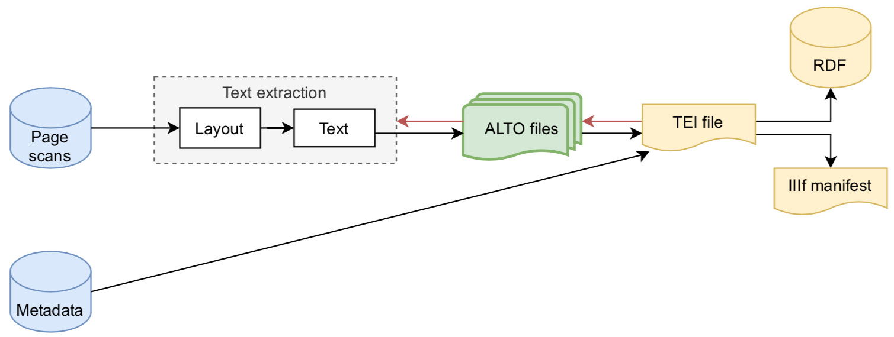

# Pipeline

SegmOnto is language independent: it aims at describing the page, no matter the digital format. This choice is necessary, because of the various needs of scholars and institutions: specialists of OCR/HTR technologies use ALTO or PAGE XML documents, while specialists of texts expect TEI files, and collections curator RDF data stored in a triplestore or IIIF manifests stored on a server.

In order to cope with the multiplicity of the needs, it has been decided to choose TEI has a pivot format.

- The data produced by the layout analyser and the HTR engine is in an ALTO format, one per page.
- All these ALTO files are concatenated into a single TEI-encoded document, with additional metadata (title, author, date of publication, shelfmark…).
- This TEI file can be used to produce RDF data and IIIF manifests, but also ALTO files, which will be used to (re)train models.

Most of our work has been done with the HTR engine Kraken, which includes an efficient layout analyser (Kiessling 2020). Data has been prepared with the application eScriptorium, via the CREMMA infrastructure in Paris and its FoNDUE counterpart in Geneva. The data being available in ALTO (cf. infra), it remains useable with any platform or system accepting these two standard formats.
